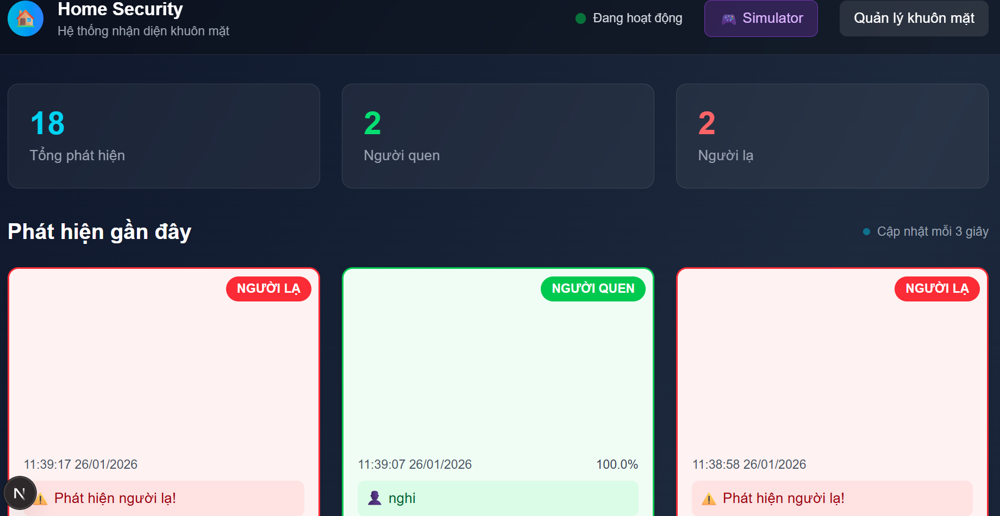
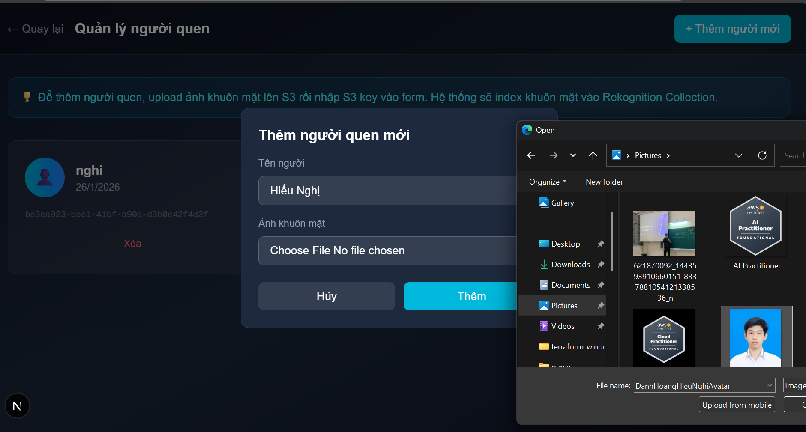
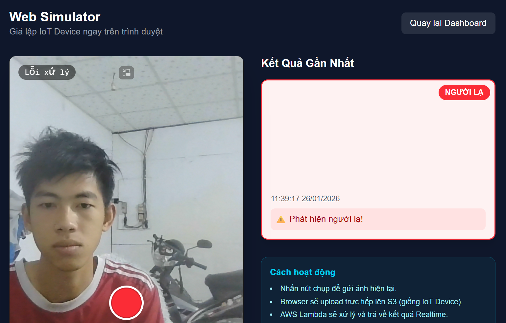
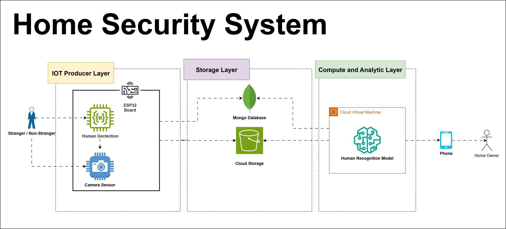

# 🏠 IoT Face Recognition System

> **Đồ án Internet of Things** - Trường Đại học Ngoại ngữ - Tin học TP.HCM

Hệ thống an ninh nhà ở thông minh sử dụng nhận diện khuôn mặt với kiến trúc Serverless. Xây dựng với AWS Lambda, Amazon Rekognition, MongoDB Atlas và Next.js.

[](https://ihatesea69.github.io/iot-face-recognition-serverless/)
[](LICENSE)

## 👥 Nhóm thực hiện

| Họ và tên | MSSV |
|-----------|------|
| Đỗ Nguyễn Phương Anh | 23DH114197 |
| Nguyễn Huỳnh Tấn Huy | 23DH111228 |
| Danh Hoàng Hiếu Nghị | 23DH112270 |

**Giảng viên hướng dẫn:** ThS. Nguyễn Tuấn Anh

---

## 📸 Screenshots

### Dashboard chính - Giám sát thời gian thực

*Giao diện hiển thị danh sách các sự kiện phát hiện với thông tin chi tiết*

### Nhận diện người quen

*Hiển thị thông tin khi nhận diện thành công người đã đăng ký*

### Simulate - Mô phỏng nhận diện

*Test quá trình nhận diện từ browser mà không cần phần cứng*

---

## 🎯 Tổng quan

Dự án xây dựng hệ thống an ninh nhà ở thông minh với khả năng:
- **Thu nhận hình ảnh** từ camera trên thiết bị biên
- **Nhận diện khuôn mặt** với Amazon Rekognition
- **Phân biệt người quen/người lạ** trong thời gian thực (<2 giây)
- **Cảnh báo** khi phát hiện người lạ xâm nhập
- **Kiến trúc Serverless** - chi phí thấp, tự động scale

## 🏗️ Kiến trúc hệ thống



Hệ thống theo mô hình **Event-Driven Serverless Architecture**:

1. **Edge Layer**: Raspberry Pi 3 Model B+ điều khiển camera, chụp ảnh và upload lên **Amazon S3**
2. **Event Layer**: S3 Event Notifications trigger **AWS Lambda** tự động
3. **Processing Layer**:
   - `ProcessImage`: Gọi **Amazon Rekognition** để nhận diện và so sánh khuôn mặt
   - `ManageFaces`: Xử lý đăng ký khuôn mặt mới và tạo presigned URLs
4. **Data Layer**: Lưu trữ metadata và logs trong **MongoDB Atlas**
5. **Presentation Layer**: **Next.js** Dashboard với real-time polling (SWR)

## ✨ Tính năng chính

| Tính năng | Mô tả |
|-----------|-------|
| 🚀 **Phản hồi <2 giây** | Từ lúc ghi nhận ảnh đến khi có kết quả cảnh báo |
| ☁️ **100% Serverless** | Không cần quản lý server, tự động scale |
| 💰 **Chi phí thấp** | Pay-per-use, gần như miễn phí khi idle |
| 🔒 **Bảo mật cao** | IAM policies nghiêm ngặt, dữ liệu mã hóa |
| 👤 **Quản lý danh tính** | Đăng ký/xóa người quen qua web interface |
| 🎭 **Phát hiện người lạ** | Tự động cảnh báo khi phát hiện stranger |
| 🧪 **Web Simulator** | Test pipeline mà không cần hardware |

## 🛠️ Technology Stack

### Cloud Services
- **AWS Lambda** - Serverless compute
- **Amazon S3** - Object storage
- **Amazon Rekognition** - Face detection & recognition AI
- **AWS IAM** - Security & access management

### Database
- **MongoDB Atlas** - Cloud database

### Frontend
- **Next.js 14** (App Router)
- **Tailwind CSS**
- **SWR** - Data fetching

### Edge/Backend
- **Python 3.12** (Boto3)
- **Raspberry Pi 3 Model B+** (RAM 1GB)
- **Adafruit PiTFT Plus 3.5"** (480x320 resistive touchscreen)
- **Camera tương thích Raspberry Pi**

## 📦 Cài đặt

### Yêu cầu
- AWS Account với credentials đã cấu hình
- MongoDB Atlas connection string
- Node.js 18+ và Python 3.10+

### 1. Triển khai Infrastructure

```bash
# Cài đặt dependencies
pip install -r infrastructure/requirements.txt

# Provision S3 và Rekognition Collection
python infrastructure/setup_aws.py

# Deploy Lambda Functions
python infrastructure/deploy_backend.py
```

### 2. Chạy Dashboard

```bash
cd dashboard
npm install

# Tạo file .env.local với MongoDB URI và Lambda URLs
cp .env.example .env.local

npm run dev
```

### 3. Cấu hình Raspberry Pi (Optional)

```bash
cd src/rpi_client
pip install -r requirements.txt

# Cấu hình config.py với AWS credentials
python main.py
```

## 📂 Cấu trúc dự án

```
├── infrastructure/     # IaC scripts cho AWS
├── src/rpi_client/     # Python client cho Raspberry Pi
├── lambda/             # AWS Lambda functions
│   ├── process_image/  # Xử lý nhận diện khuôn mặt
│   └── manage_faces/   # API quản lý danh tính
├── dashboard/          # Next.js web application
└── docs/               # GitHub Pages landing page
```

## 🚀 Sử dụng

1. **Đăng ký khuôn mặt**: Truy cập `/faces`, upload ảnh và nhập tên
2. **Mô phỏng**: Dùng `/simulate` để test với webcam
3. **Giám sát**: Xem dashboard chính để theo dõi các sự kiện

## 📄 License

MIT License - Xem file [LICENSE](LICENSE) để biết thêm chi tiết.

---

<p align="center">
  <strong>🎓 Đồ án IoT - ĐH Ngoại ngữ - Tin học TP.HCM - 2026</strong>
</p>
