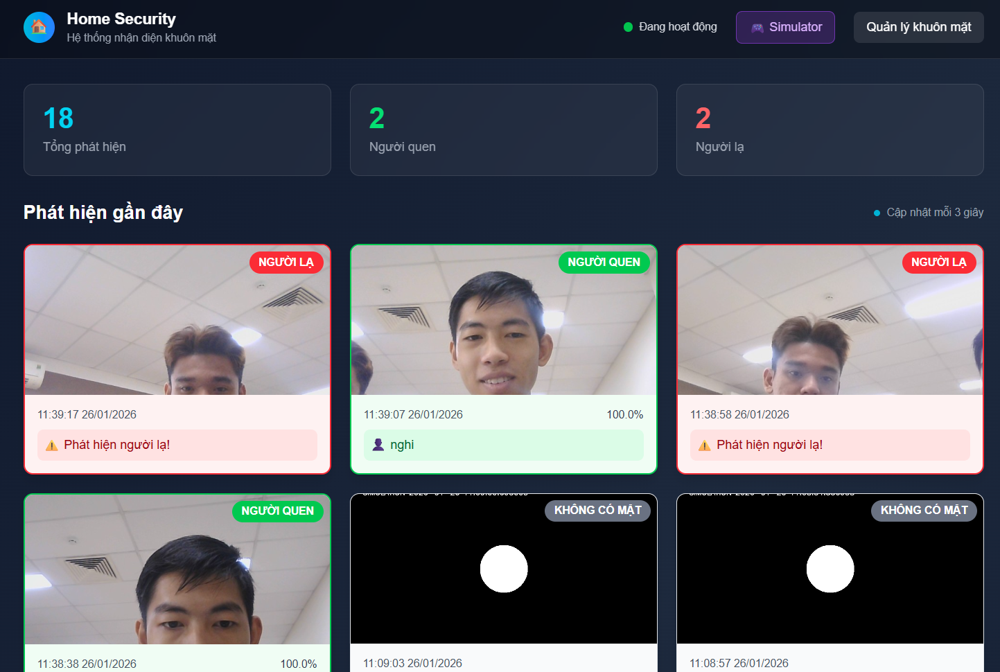
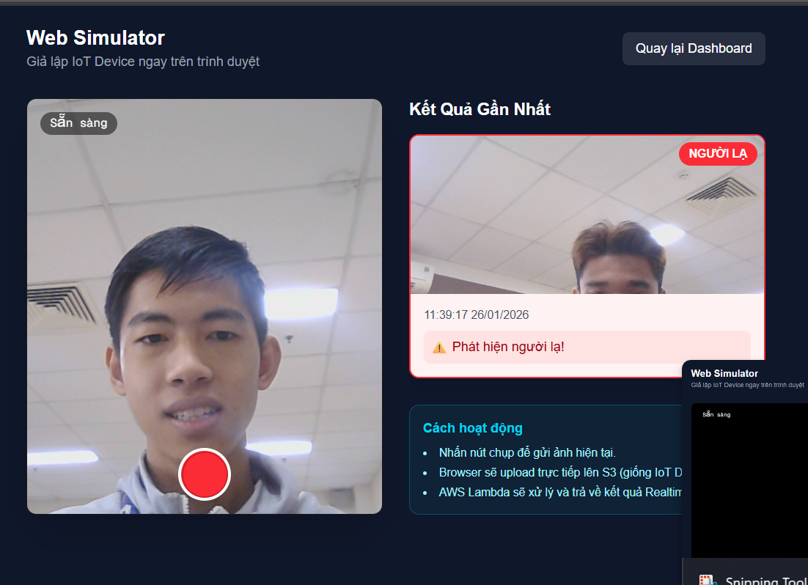

# IoT Face Recognition System

Serverless IoT solution for real-time face recognition and home security monitoring. Built with AWS Lambda, Amazon Rekognition, MongoDB, and Next.js.


_Real-time dashboard showing detection events and device status_


_Web-based simulator for testing detection pipeline without hardware_

## Overview

This project implements a scalable, serverless pipeline for processing image data from edge devices (Raspberry Pi). It utilizes AWS managed services to ensure high availability and low maintenance overhead. The system detects motion, captures facial imagery, indexes known identities, and alerts on strangers in real-time.

## Architecture

The system follows an event-driven serverless architecture:

1.  **Edge Layer**: Raspberry Pi (or Web Simulator) captures images upon motion detection and uploads to **Amazon S3**.
2.  **Event Layer**: S3 Event Notifications trigger **AWS Lambda** functions asynchronously.
3.  **Processing Layer**:
    - **ProcessImage**: Calls **Amazon Rekognition** to detect and match faces against a collection.
    - **ManageFaces**: Handles API requests for indexing new identities and generating presigned URLs.
4.  **Data Layer**: Metadata and detection logs are stored in **MongoDB Atlas**.
5.  **Presentation Layer**: A **Next.js** dashboard provides real-time monitoring via SWR polling and manages identity registration.

## Features

- **Real-time Recognition**: Instant processing of uploaded images with latency under 2 seconds.
- **Identity Management**: Web interface for registering "Known Persons" directly to the Rekognition Collection.
- **Stranger Detection**: Automatic classification and alerting for unrecognized faces.
- **Edge Simulation**: Integrated web-based simulator to test the full pipeline using a distinct webcam device.
- **Infrastructure as Code**: Automated Python scripts for provisioning AWS resources (IAM Roles, S3 Buckets, Lambda Functions, Triggers).

## Technology Stack

- **Cloud**: AWS Lambda, Amazon S3, Amazon Rekognition, AWS IAM.
- **Database**: MongoDB Atlas.
- **Frontend**: Next.js 14 (App Router), Tailwind CSS, SWR.
- **Edge/Backend**: Python 3.12 (Boto3), Node.js (AWS SDK).

## Installation

### Prerequisites

- AWS Account with valid credentials configured locally.
- MongoDB Atlas connection string.
- Node.js 18+ and Python 3.10+.

### Infrastructure Setup

The project includes automation scripts to provision the required AWS environment in `us-east-1`.

```bash
# Install Python dependencies
pip install -r infrastructure/requirements.txt

# Provision S3 and Rekognition Collection
python infrastructure/setup_aws.py

# Deploy Lambda Functions and API Gateways
python infrastructure/deploy_backend.py
```

### Dashboard Setup

```bash
cd dashboard
npm install

# Configure environment variables
# Create a .env.local file based on .env.example with your MongoDB URI and Lambda URLs

npm run dev
```

## Usage

1.  **Registering Identities**: Access the dashboard at `http://localhost:3000/faces`. Upload clear facial images to index them as known persons.
2.  **Simulation**: Use the Simulator tab at `http://localhost:3000/simulate` to capture live images from your webcam.
3.  **Monitoring**: View the main dashboard to see a live feed of detection events classified as "Known" or "Stranger".

## Project Structure

- `infrastructure/`: IaC scripts for AWS deployment.
- `src/rpi_client/`: Python client for Raspberry Pi hardware integration.
- `lambda/`: Serverless function code (ProcessImage, ManageFaces).
- `dashboard/`: Next.js web application source code.
